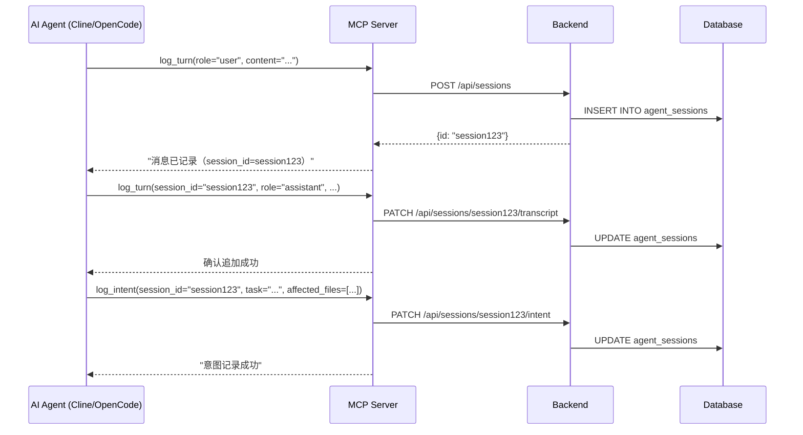
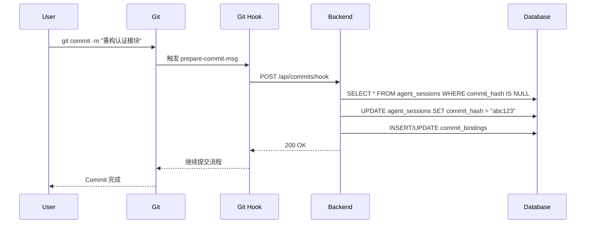
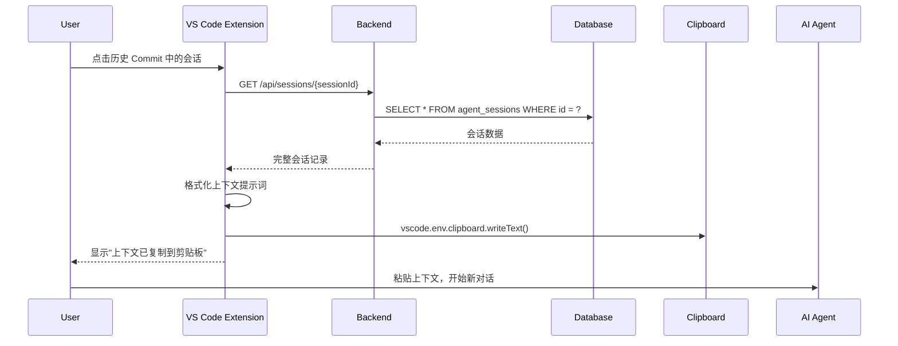

# 架构设计

AgentLog 采用前后端分离的 Monorepo 架构，基于 MCP 协议实现 AI 交互的主动上报，并通过 Git Hook 实现自动绑定。

## 整体架构

```
┌─────────────────────────────────────────────────────────────┐
│                    AI Agent (Cline/OpenCode/Cursor)         │
│  ┌──────────────────────────────────────────────────────┐  │
│  │  MCP Client                                          │  │
│  │  • log_turn (逐轮上报)                                │  │
│  │  • log_intent (任务汇总)                              │  │
│  │  • query_historical_interaction (历史查询)            │  │
│  └────────────┬─────────────────────────────────────────┘  │
└───────────────┼─────────────────────────────────────────────┘
                │ stdio (MCP 协议)
                ▼
┌─────────────────────────────────────────────────────────────┐
│                    AgentLog MCP Server                       │
│  ┌──────────────────────────────────────────────────────┐  │
│  │  @modelcontextprotocol/sdk                           │  │
│  │  • 工具注册与分发                                    │  │
│  │  • 客户端信息推断                                    │  │
│  │  • Token 用量估算                                    │  │
│  └────────────┬─────────────────────────────────────────┘  │
└───────────────┼─────────────────────────────────────────────┘
                │ HTTP (REST API)
                ▼
┌─────────────────────────────────────────────────────────────┐
│                    AgentLog Backend                          │
│  ┌───────────────┐  ┌───────────────┐  ┌───────────────┐  │
│  │   REST API    │  │   Services    │  │  Database     │  │
│  │  • Fastify    │  │  • 会话管理   │  │  • SQLite     │  │
│  │  • 路由层     │  │  • Git 集成   │  │  • 迁移系统   │  │
│  │  • 验证中间件 │  │  • 导出服务   │  │  • WAL 模式   │  │
│  └───────┬───────┘  └───────┬───────┘  └───────┬───────┘  │
└──────────┼───────────────────┼───────────────────┼──────────┘
           │                   │                   │
           ▼                   ▼                   ▼
    ┌─────────────┐    ┌─────────────┐    ┌─────────────┐
    │   HTTP客户端 │    │   Git仓库   │    │  本地文件   │
    │  • VS Code  │    │  • Hooks    │    │  • SQLite   │
    │  • Webview  │    │  • Commits  │    │  • 日志文件 │
    └─────────────┘    └─────────────┘    └─────────────┘
```

## Monorepo 结构

AgentLog 使用 pnpm workspaces 管理多包项目：

```
agentlog/
├── packages/
│   ├── shared/                    # 共享类型定义
│   │   └── src/
│   │       ├── index.ts           # 公共导出
│   │       └── types.ts           # AgentSession, CommitBinding 等核心类型
│   │
│   ├── backend/                   # 本地轻量后台
│   │   └── src/
│   │       ├── index.ts           # 服务入口（Fastify）
│   │       ├── db/
│   │       │   ├── database.ts    # SQLite 初始化 + Schema
│   │       │   └── migrations/    # 数据库迁移脚本
│   │       ├── routes/
│   │       │   ├── sessions.ts    # /api/sessions CRUD
│   │       │   ├── commits.ts     # /api/commits 绑定
│   │       │   ├── export.ts      # /api/export 导出
│   │       │   └── health.ts      # 健康检查
│   │       ├── services/
│   │       │   ├── logService.ts  # 会话业务逻辑
│   │       │   ├── gitService.ts  # Git 集成（simple-git）
│   │       │   └── exportService.ts # 报告渲染
│   │       └── mcp.ts             # MCP Server 入口
│   │
│   └── vscode-extension/          # VS Code/Cursor 插件
│       └── src/
│           ├── extension.ts       # 插件主入口
│           ├── client/
│           │   └── backendClient.ts   # HTTP 客户端
│           ├── providers/
│           │   ├── sessionTreeProvider.ts    # 侧边栏 TreeView
│           │   └── sessionWebviewProvider.ts # 详情 Webview
│           └── commands/
│               ├── configureMcp.ts    # MCP 配置向导
│               └── verifyConnection.ts # 连接验证
│
├── package.json                   # pnpm monorepo 根配置
├── pnpm-workspace.yaml
└── README.md
```

## 核心工作流

### 工作流一：MCP 主动记录路径

**目的**：AI Agent 主动上报交互记录，避免网络拦截的兼容性问题。



**关键设计**：
1. **首次调用自动创建会话**：`log_turn` 不带 `session_id` 时创建新会话
2. **逐轮追加**：后续调用传入 `session_id`，追加到同一会话
3. **任务汇总**：`log_intent` 补充任务意图和受影响文件
4. **离线容错**：MCP Server 缓存未发送的数据，网络恢复后重试

### 工作流二：Git Hook 绑定路径

**目的**：自动将游离的 AI 会话绑定到 Git Commit，建立代码变更与 AI 决策的关联。



**关键设计**：
1. **事务操作**：绑定操作在事务中完成，确保数据一致性
2. **时间窗口**：只绑定提交时间附近的游离会话（默认 ±5 分钟）
3. **兜底逻辑**：若无游离会话，读取 Git Diff 生成简要意图记录
4. **手动覆盖**：支持在侧边栏手动调整绑定关系

### 工作流三：上下文复活路径

**目的**：从历史 Commit 提取 AI 交互记录，作为新对话的上下文，实现“记忆传承”。



**关键设计**：
1. **智能格式化**：将历史会话转换为适合 AI 理解的提示词格式
2. **内容截断**：自动截断过长的上下文，保留核心信息
3. **多格式支持**：支持 Markdown、JSON、XML 等多种输出格式
4. **一键操作**：最小化用户操作步骤，提升体验

## 数据流设计

### 数据写入流

```
AI Agent → MCP Server → Backend API → SQLite
      ↑           ↑           ↑          ↑
   stdio       HTTP/1.1     Fastify   better-sqlite3
  传输层      应用层协议    Web框架     数据库驱动
```

### 数据读取流

```
VS Code Extension → Backend API → SQLite → 响应格式化 → Webview 渲染
      ↑                   ↑           ↑           ↑             ↑
   HTTP Client         Fastify     SQL查询    JSON序列化     React组件
```

### 数据同步流

```
Git Hook → Backend API → 事务处理 → 更新两个表 → 返回成功
    ↑           ↑           ↑           ↑           ↑
 prepare-   REST调用    BEGIN COMMIT   sessions   HTTP 200
 commit-msg                          & bindings
```

## 技术栈选型

| 组件 | 技术选型 | 选型理由 |
|------|----------|----------|
| **Monorepo 管理** | pnpm workspaces | 依赖隔离、构建优化、开发体验好 |
| **语言** | TypeScript 5.x | 类型安全、生态完善、全栈统一 |
| **后端框架** | Fastify 4.x | 高性能、低开销、插件体系完善 |
| **数据库** | SQLite (better-sqlite3) | 本地优先、零配置、WAL 模式支持 |
| **Git 集成** | simple-git | Promise API、跨平台、维护活跃 |
| **MCP 协议** | @modelcontextprotocol/sdk | 官方 SDK、标准兼容、社区支持 |
| **VS Code API** | @types/vscode ^1.85 | 官方类型定义、版本兼容 |
| **构建工具** | tsup / tsx | 快速构建、ESM 支持、开发热重载 |

## 数据库设计

### 核心表结构

#### agent_sessions
存储 AI 交互会话的完整记录，包含逐轮对话（transcript）和 Token 用量统计。

```sql
CREATE TABLE agent_sessions (
  id TEXT PRIMARY KEY,                -- nanoid
  created_at TEXT,                    -- ISO 8601
  provider TEXT,                      -- 'deepseek', 'openai', 'anthropic'
  model TEXT,                         -- 'deepseek-r1', 'gpt-4'
  source TEXT,                        -- 'cline', 'cursor', 'opencode'
  workspace_path TEXT,                -- 工作区绝对路径
  prompt TEXT,                        -- 用户提示
  reasoning TEXT,                     -- 模型推理过程（可为 NULL）
  response TEXT,                      -- 模型响应
  commit_hash TEXT,                   -- 关联的 Git commit hash
  affected_files TEXT,                -- JSON 数组：["src/foo.ts", "src/bar.ts"]
  duration_ms INTEGER,                -- 会话耗时（毫秒）
  tags TEXT,                          -- JSON 数组：["bugfix", "重构"]
  note TEXT,                          -- 用户备注
  metadata TEXT,                      -- JSON 对象：provider 特定扩展字段
  transcript TEXT,                    -- JSON 数组：逐轮对话记录
  token_usage TEXT                    -- JSON 对象：Token 用量统计
);
```

#### commit_bindings
存储 Git Commit 与 AgentSession 的绑定关系。

```sql
CREATE TABLE commit_bindings (
  commit_hash TEXT PRIMARY KEY,       -- Git commit hash
  session_ids TEXT,                   -- JSON 数组：["session1", "session2"]
  message TEXT,                       -- commit 消息
  committed_at TEXT,                  -- 提交时间
  author_name TEXT,                   -- 提交者名称
  author_email TEXT,                  -- 提交者邮箱
  changed_files TEXT,                 -- JSON 数组：变更的文件列表
  workspace_path TEXT                 -- 工作区路径
);
```

### 索引设计

```sql
-- 按创建时间查询（侧边栏时间倒序）
CREATE INDEX idx_sessions_created_at ON agent_sessions(created_at DESC);

-- 按工作区查询（多项目支持）
CREATE INDEX idx_sessions_workspace ON agent_sessions(workspace_path);

-- 按模型提供商查询（统计过滤）
CREATE INDEX idx_sessions_provider ON agent_sessions(provider);

-- 按 Commit 查询（查看 Commit 关联会话）
CREATE INDEX idx_sessions_commit_hash ON agent_sessions(commit_hash);

-- Commit 时间查询（历史记录排序）
CREATE INDEX idx_commits_committed_at ON commit_bindings(committed_at DESC);

-- 工作区 Commit 查询
CREATE INDEX idx_commits_workspace ON commit_bindings(workspace_path);
```

### 数据迁移

采用版本化迁移系统，确保平滑升级：

```typescript
// 迁移脚本示例
const migrations = [
  {
    version: 1,
    up: `CREATE TABLE agent_sessions (...)`,
    down: `DROP TABLE agent_sessions`
  },
  {
    version: 2,
    up: `ALTER TABLE agent_sessions ADD COLUMN transcript TEXT`,
    down: `CREATE TEMP TABLE ...`  // 复杂的回滚逻辑
  }
];
```

## 性能考量

### 数据库性能
- **WAL 模式**：支持读写并发，提高多客户端场景性能
- **连接池**：复用数据库连接，减少连接开销
- **批量操作**：Git Hook 绑定使用批量更新，减少事务数量

### 内存优化
- **流式处理**：大文件导出使用流式 API，避免内存溢出
- **分页查询**：历史记录查询默认分页，限制单次数据量
- **懒加载**：Webview 内容按需加载，提升响应速度

### 网络优化
- **本地优先**：所有通信走 localhost，避免网络延迟
- **请求合并**：MCP 客户端可批量上报消息，减少请求数
- **缓存策略**：频繁访问的数据（如统计信息）适当缓存

## 扩展性设计

### 插件体系
VS Code 扩展采用 providers 模式，便于功能扩展：

```typescript
// 扩展点：TreeDataProvider
export class SessionTreeProvider implements vscode.TreeDataProvider<SessionTreeItem> {
  // 实现 getChildren, getTreeItem 等方法
}

// 扩展点：WebviewViewProvider
export class SessionWebviewProvider implements vscode.WebviewViewProvider {
  // 实现 resolveWebviewView 方法
}
```

### 服务层抽象
后端服务层接口清晰，便于替换实现：

```typescript
interface ILogService {
  createSession(data: CreateSessionDTO): Promise<string>;
  appendTranscript(sessionId: string, turns: TranscriptTurn[]): Promise<void>;
  updateIntent(sessionId: string, intent: UpdateIntentDTO): Promise<void>;
  // ...
}
```

### MCP 工具扩展
MCP Server 支持动态添加工具，未来可扩展更多能力：

```typescript
server.setRequestHandler(ListToolsRequestSchema, async () => ({
  tools: [
    // 现有工具
    { name: "log_turn", ... },
    { name: "log_intent", ... },
    { name: "query_historical_interaction", ... },
    // 未来可能添加
    { name: "suggest_tags", description: "AI 建议会话标签" },
    { name: "summarize_session", description: "自动总结会话要点" }
  ]
}));
```

## 安全设计

### 数据安全
- **本地存储**：所有数据存储在本机 SQLite，不上传云端
- **文件权限**：数据库文件设置合理权限（600）
- **加密选项**：支持 SQLCipher 加密（可选）

### 访问安全
- **本地监听**：默认只监听 127.0.0.1，不暴露到外部网络
- **CORS 限制**：仅允许 localhost 和 VS Code Webview 来源
- **输入验证**：所有 API 输入严格验证和清理

### 隐私保护
- **无遥测**：不收集任何使用统计数据
- **数据最小化**：只记录必要的交互信息
- **用户控制**：支持数据导出和完全删除

## 部署架构

### 开发环境
```
开发者机器
├── VS Code + AgentLog 扩展
├── AgentLog 后台服务（pnpm dev）
├── SQLite 数据库（~/.agentlog/agentlog.db）
└── AI Agent（Cline/OpenCode）通过 MCP 连接
```

### 生产环境（团队使用）
```
团队成员机器（相同配置）
├── 统一安装 AgentLog VS Code 扩展
├── 统一配置 MCP 客户端
├── 共享导出数据（通过版本控制）
└── 统一代码审查流程（集成 AI 上下文）
```

### 未来扩展
- **中央服务器模式**：可选的企业版，集中存储和分析数据
- **团队协作功能**：共享会话库、协作标注、知识图谱
- **云同步**：端到端加密的跨设备数据同步

## 监控与维护

### 健康检查
```bash
# HTTP 健康检查端点
GET /health → { "status": "ok", "version": "0.4.0", "database": "connected" }

# 数据库状态
GET /api/sessions/stats → { "totalSessions": 150, "unboundSessions": 3, ... }
```

### 日志系统
- **结构化日志**：JSON 格式，便于日志收集系统处理
- **分级输出**：debug/info/warn/error 多级别控制
- **日志轮转**：自动轮转日志文件，避免磁盘占满

### 故障恢复
- **自动重试**：MCP 连接失败时自动重连
- **数据校验**：定期检查数据库一致性
- **备份恢复**：支持数据库备份和恢复功能
## Phase 1 新架构：双流采集与 JIT 状态复水

AgentLog Phase 1 对原有架构进行了重大升级，确立了 **Trace/Span 体系**。

### 1. 网关 + 旁路探针双流采集机制
为彻底解决人类微操与 Agent 流转的断点问题，我们引入了双流采集引擎：
- **外部流 (External Stream)**：通过 Git Hook (`post-commit`) 与编辑器插件，自动捕获人类开发者的手动修改与提交流程，封装为 `actor: human` 的 Span 并推送至网关。
- **内部流 (Internal Stream)**：通过 OpenClaw 旁路探针 (Telemetry Probe)，无阻塞拦截 `<think>` 与工具调用，通过 `POST /api/spans` 进行上报。

### 2. JIT Context Hydration (跨 Agent 急诊交接)
当 Agent 流水线中断（例如 Builder Agent 运行失败）时：
- 无需将完整的日志作为 prompt 传递。
- 只需将当前失败任务的 `TraceID` 传给后续接管的 Reviewer Agent。
- Reviewer Agent 可通过内置的 MCP 工具 `get_failed_attempts(trace_id)` 实时从网关提取结构化的历史栈和环境状态，实现状态**复水 (Hydration)**。
