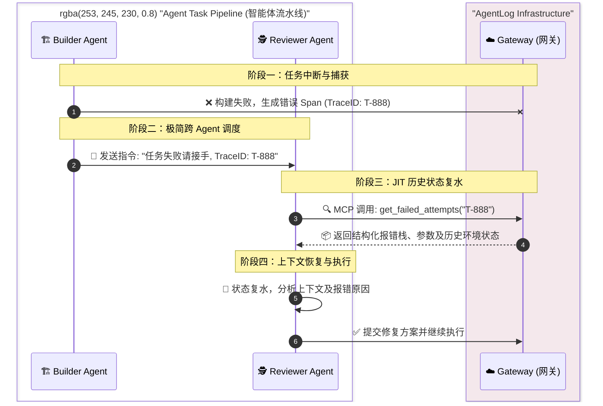

# AgentLog 人机协同工作流 (Phase 1)

AgentLog Phase 1 引入了全新的 **Trace/Span 数据模型** 与 **双流采集机制**，旨在彻底解决 AI Agent 与人类开发者在复杂协作过程中的“上下文断层”问题。

## 核心痛点与解决方案

在传统的 Agent 协作开发中，通常面临以下困境：
- **断点流转**：Agent 报错停止，人类接管修改代码，再次唤醒 Agent 时，Agent 丢失了人类修改的上下文。
- **状态孤岛**：不同 Agent 之间的切换（如从 Builder 到 Reviewer）难以传递完整的执行历史和报错环境。

AgentLog Phase 1 的核心创新在于**人机一致性追踪**：
你的每一次 Git 提交、每一条命令行干预，都会被网关自动捕获，并作为人类维度的 Span 挂载到当前的全局 TraceID 之下。这让 AgentLog 具备了真正意义上的 JIT (Just-In-Time) 上下文恢复能力。

## 典型使用场景 (Use Cases)

### 场景一：人机混合微操接管 (Handoff Tracing)

**痛点**：Agent 陷入死循环或遇到复杂的逻辑问题，人类开发者需要紧急介入，手动修改几行代码并提交，然后让 Agent 继续工作。

**工作流**：
1. **任务失败透传**：Builder Agent 构建失败，只需向后继 Reviewer 抛出极简指令：“任务失败，请接手。TraceID: T-888”。
2. **自主溯源**：Reviewer Agent 收到指令后，通过自带的 MCP 工具调用 `get_failed_attempts(trace_id="T-888")` 发起主动查询。
3. **状态复水 (Hydration)**：AgentLog 网关立即返回结构化的历史报错栈、输入参数及上一步的环境状态。Reviewer Agent 无需从零开始诊断，直接基于错误栈进行修复。

> 🖼️ **[在此处插入截屏/录屏占位]**
> *说明：截屏/录屏展示 Builder 任务失败后，终端/UI 将 TraceID 传递给 Reviewer。Reviewer 通过调用 `get_failed_attempts` 工具瞬间拉取报错详情的日志画面。*

## 数据模型：Trace 与 Span

Phase 1 全面废弃了过往的松散 Session 表，转而采用工业级可观测性标准设计：
- **Trace (全局追踪)**：代表一次完整的研发意图或多步骤任务流。通过 ULID 标识，穿透所有参与的 Agent 生命周期。
- **Span (工作单元)**：无论是 Agent 调用的一个 MCP 工具、一次大模型推理 `<think>`，还是人类的一次 Git 提交，都抽象为统一的 Span 数据结构。包含 `actor_type`（agent/human）、`payload` 和时序信息。

## 技术架构简析

AgentLog Phase 1 采用了独特的**“网关 + 旁路探针”双流采集机制**：
1. **内部流 (旁路探针)**：无侵入式拦截大模型的思维链（`<think>`）与工具调用，通过异步 `POST /api/spans` 接口上报，对主业务零阻塞。
2. **外部流 (Git Hook / 插件)**：覆盖人类开发者的物理按键行为（如 IDE 保存、Git 提交），与探针数据在网关侧进行统一排序合并。

---
了解更多技术细节，请参阅 [架构演进文档](./architecture.md) 或 [数据模型指南](./data-model.md)。