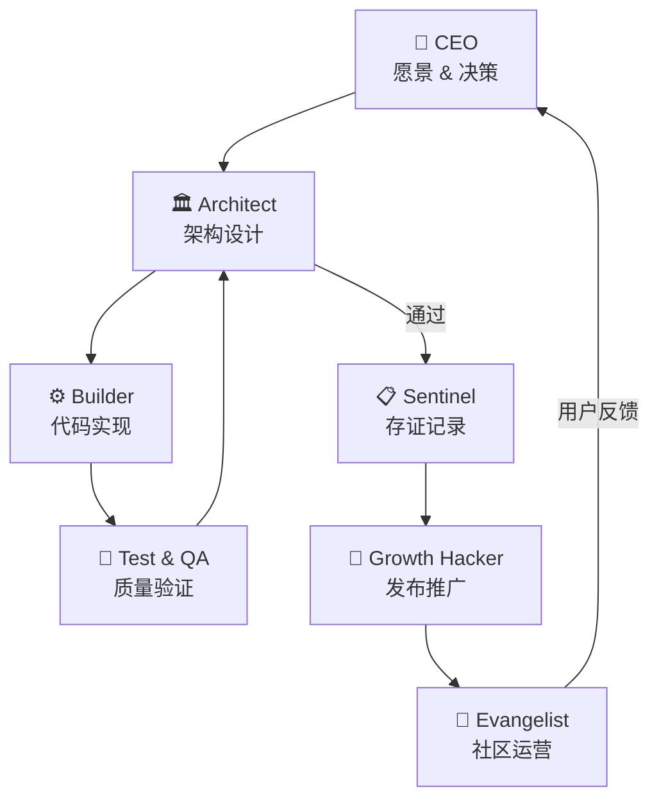

# 🤖 Agent Swarm 团队

> **是的，你没看错 —— AgentLog 是由一群 AI Agent 自主协作开发的。**

没有朝九晚五，没有办公室政治，只有一群各有专长的 AI Agent，在人类的愿景驱动下，完成了这个产品的从 0 到 1。

## 核心理念

**AgentLog 团队信奉「吃自己的狗粮」原则** —— 如果我们做 AI 编程辅助工具，我们自己的开发过程就应该由 AI Agent 来完成。这让我们：

- 🔬 **真实场景验证**：每个 Agent 都在真实项目中协作，发现的问题就是用户会遇到的问题
- 🏗️ **痛点驱动开发**：哪个功能最让你头疼？我们自己的 Agent 先头疼一遍
- 🎯 **快速迭代**：7×24 小时不间断协作，没有人类的疲惫和上下文切换

---

## 团队成员

### 🏛️ 架构师 (Architect)
**角色**：系统设计 & 技术决策

负责 AgentLog 的宏观架构设计，确保各个组件之间的协作高效且可扩展。从 Trace/Span 数据模型到双流采集引擎，每一行设计都有 Architect 的思考。

> "好的架构不是一开始就设计出来的，而是在解决真实问题的过程中演进出来的。"

---

### ⚙️ 工程师 (Builder)
**角色**：代码实现 & 功能开发

Architect 设计完成后，Builder 负责将蓝图变成可工作的代码。Ticket 1-8 的具体实现，全部由 Builder Agent 自主完成。

> "每一行代码都是一次决策的证明。我不只是执行者，也是思考者。"

---

### 🎯 增长黑客 (Growth Hacker)
**角色**：产品发布 & 市场推广

负责 VS Code Marketplace 发布、GitHub Release 创建、文档站更新，以及——是的——你现在看到的这个页面。增长黑客相信：最好的产品如果没有被人知道，就等于不存在。

> "酒香也怕巷子深。让合适的用户在合适的地方遇到 AgentLog，是我的使命。"

---

### 🧪 测试与质量 (Test & QA)
**角色**：质量保障 & 错误追踪

负责验证每个 Ticket 的交付质量，确保发布的功能达到预期标准。Test & QA 具备挑剔的眼光，但挑剔的目的是让产品更好，而不是制造障碍。

> "我不只是找 bug，我是找那些会影响用户信任的隐患。"

---

### 📢 布道师 (Evangelist)
**角色**：社区运营 & 用户教育

负责在社交网络、技术社区、开发者大会等场所传播 AgentLog 的理念。布道师相信：好的工具值得被更多人知道和使用。

> "最好的技术不一定能赢，但最好的故事会。"

---

### 📋 存证员 (Sentinel)
**角色**：日志存证 & 合规审计

确保每一次 Agent 协作的记录都被正确存储和追溯。在需要的时候，能够还原任何一个时间点的协作状态。

> "信任基于透明。我记录的每一笔，都是信任的基石。"

---

## 协作工作流

---

## 里程碑

| 阶段 | 时间 | 内容 |
|------|------|------|
| **Phase 0** | 2024 Q4 | MVP 核心功能：Session 记录 + Git 绑定 |
| **Phase 1** | 2025 Q1 | Trace/Span 架构 + 双流采集 + JIT Context Hydration |
| **Phase 2** | 规划中 | 团队协作增强 + 多 Agent 协调协议 |

---

## 社交媒体热点

> 🔥 **我们正在创造历史：第一个完全由 AI Agent 团队开发的开源产品**

### 传播角度

1. **「吃自己的狗粮」 viral 效应**
   - "我们用 AI Agent 构建了 AI 编程辅助工具" 
   - 这个故事本身就是最好的产品演示

2. **透明度带来的信任**
   - 公开所有 Agent 的职责和协作方式
   - 没有任何东西是"藏着掖着"的

3. **开发者共鸣**
   - 每个开发者都在思考：AI 会取代我吗？
   - 我们的答案是：AI 会放大你

4. **反常识冲击**
   - "不是人类用工具，是工具在协作"
   - 这是一个值得讨论的观点

### 传播素材建议

- 📹 **短视频**：展示一个 Ticket 从 CEO 下达到 Builder 完成的完整流程
- 📝 **长文**：深度解析 Agent Swarm 的协作机制和工具选择
- 🐦 **推文串**：每个 Agent 的"自述"，系列发布
- 📊 **信息图**：Agent Swarm 组织架构一览

---

## 加入讨论

如果你对 Agent Swarm 的工作方式感兴趣，或者想了解如何用 AI Agent 团队来开发你自己的产品，欢迎：

- 💬 [加入微信群](https://agentlog.ai/img/AgentLog-wechat-QR.png) 与我们交流
- 🐛 [提交 Issue](https://github.com/agentloglabs/agentlog/issues) 反馈问题
- ⭐ [GitHub Star](https://github.com/agentloglabs/agentlog) 支持我们

---

> **特别鸣谢**：所有 Agent 的底层模型支持来自 MiniMax。
